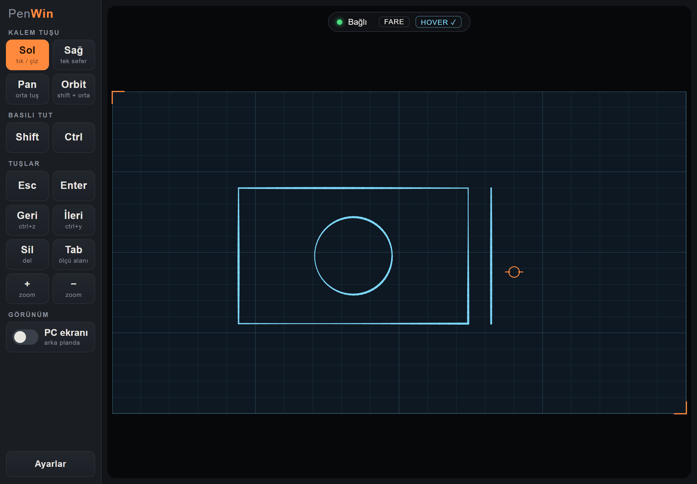
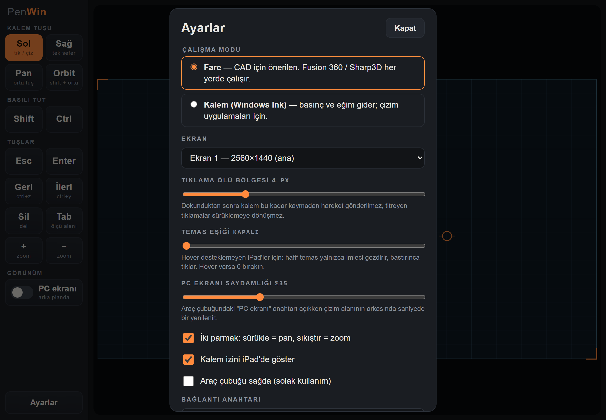

# PenWin

**English** | [Türkçe](README.tr.md)

Turns an iPad + Apple Pencil into a wireless drawing tablet for Windows. **Nothing is installed on the iPad**: you open an address in Safari and your pen movements reach the PC instantly over the local Wi-Fi. Built for working with a pen instead of a mouse in CAD programs such as Sharp3D and Fusion 360.

> The iPad interface is currently in Turkish; the button names are given below with their meaning.

### iPad screen — the PenWin page opened in Safari



*Captured on the iPad (1180×820, landscape). The blue lines are the pen's temporary trail on the iPad; the orange crosshair is the position of the hovering pen.*

```
 iPad (Safari)                         Windows PC
 ┌───────────────────┐   WebSocket    ┌──────────────────────────────┐
 │ Pointer Events    │ ── Wi-Fi ───▶  │ penwin.exe                   │
 │ (pen, pressure,   │ ~1 line/sample │  ├─ tiny HTTP + WS server    │
 │  tilt, hover)     │                │  ├─ SendInput  → mouse/keys  │
 │ toolbar           │ ◀── hello/pong │  └─ Synthetic Pointer → Ink  │
 └───────────────────┘                └──────────────────────────────┘
```

The iPad works like a **screenless tablet** such as a Wacom Intuos: you move the pen on the iPad and watch the cursor on the monitor. If you want to see where you are, the **PC ekranı** (PC screen) switch in the toolbar places a semi-transparent image of the selected monitor behind the drawing area, refreshed once per second. The drawing area on the iPad has the selected monitor's aspect ratio and maps one-to-one onto the whole monitor.

## Requirements

- Windows 10 (1809+) or 11. The compiler (`csc.exe`) already ships with Windows as part of .NET Framework 4; nothing else to install.
- Safari on the iPad (iPadOS 15.4+). With Apple Pencil hover (Pencil Pro / Pencil 2 on supported iPads) the cursor moves before the pen touches the screen.
- The PC and the iPad must be on the same local network. 5 GHz Wi-Fi noticeably lowers latency.

## Running

```bash
start.cmd
```

On the first run `build.cmd` is called automatically and produces `bin\penwin.exe`. The window shows an address like this:

```
  iPad'de Safari ile şu adresi açın:
     http://192.168.1.20:8765/#k=K7M2QX
```

1. If Windows Firewall asks, allow access on **Private networks**.
2. Open the address in Safari on the iPad. The indicator at the top should read **Bağlı** (connected).
3. For everyday use choose *Share → Add to Home Screen* in Safari: it opens full screen without the address bar and remembers the key.

The key (`#k=...`) is stored in `%LOCALAPPDATA%\PenWin\token.txt` and survives rebuilds. Run `start.cmd --new-key` to generate a new one.

## Usage

**Pen** — In the default **mouse mode** the pen is the left button: tap = click, drag = drag, hover = move the cursor (if hover is supported).

**Toolbar** (on the left; can be moved to the right in the settings):

| Button | What it does |
| --- | --- |
| Sol (left) | Pen is the left button (default) |
| Sağ (right) | The next touch is a right click, then it returns to left |
| Pan | Pen drags with the middle button (pans the view in Fusion 360) |
| Orbit | Pen drags with Shift + middle button (orbits in Fusion 360) |
| Shift / Ctrl | Stays held down until tapped again (for multi-select) |
| Esc, Enter, Sil (Delete), Tab | Keys. Tab moves between dimension input fields in Fusion |
| Geri / İleri (undo / redo) | Ctrl+Z / Ctrl+Y |
| + / − | Mouse wheel (zoom) |
| PC ekranı (PC screen) | When on, the selected monitor appears semi-transparent behind the drawing area (1 frame per second). If it cannot be captured the button shows "alınamadı" (failed), e.g. on the lock screen or a UAC prompt. |

While Pan or Orbit is active, tapping the same button again returns to left click.

**Two fingers** (can be turned off in the settings): drag = pan (middle button), pinch = zoom (wheel). Finger and palm touches right after pen use are ignored.

**Settings (Ayarlar)**

*iPad screen — the settings window:*



- **Mode:** *Fare* (mouse) is recommended for CAD and works in every program. *Kalem (Windows Ink)* (pen) sends pressure and tilt as real pen input; it is meant for pressure-sensitive drawing programs. In this mode right/pan/orbit are still sent as mouse input.
- **Ekran (screen):** Which monitor to map when there are several.
- **Click dead zone:** After the pen touches down, no movement is sent until it moves this many pixels. A shaky tap therefore does not become an unwanted drag in CAD (e.g. an arc instead of a line in Fusion). Default 4 px.
- **PC screen opacity:** How visible the background image is (default 35%).
- **Contact threshold:** For iPads without hover. A light touch only moves the cursor; it clicks once this pressure is exceeded.

## Troubleshooting

| Symptom | Fix |
| --- | --- |
| The page does not open on the iPad | Check the firewall permission (*Windows Security → Firewall → Allow an app* → `penwin.exe`, Private). If the network profile is *Public*, switch it to *Private*. Guest Wi-Fi networks isolate devices from each other and may not work. |
| "Anahtar hatalı" (wrong key) | Enter the 6-character key shown in the PC window in the settings. |
| "Başka bir cihaz bağlandı" (another device connected) | Only one device controls the PC at a time; the last one to connect wins. |
| Nothing happens in some windows | Windows blocks outside input to programs running as administrator. Run `penwin.exe` as administrator too. |
| Cursor stutters / high latency | Check the ms value in the indicator. Switch to 5 GHz, move the iPad closer to the router. |
| The connection drops | No key or button stays held down; the server releases everything. The page reconnects by itself. |

## Limitations

- Apple Pencil Pro's squeeze, double tap and barrel roll are not exposed to web pages; the toolbar replaces them.
- The connection is unencrypted HTTP/WebSocket on the local network. Control and screen images are protected by the 6-character key; do not run it on networks you do not trust.
- The screen image is not a live stream; one frame arrives per second and it is meant for finding your position. The mouse cursor is not in the image; the orange cursor on the iPad is used instead.
- If the page is opened in a browser on the PC itself, mouse events are ignored on purpose (so the cursor cannot drive itself in a loop).

## Command line

```
penwin.exe [--port 8765] [--bind 0.0.0.0] [--new-key] [--dry-run] [--web <folder>]
```

- `--port`: port to listen on.
- `--bind`: listen only on a specific interface (e.g. `127.0.0.1` for testing).
- `--new-key`: generate a new connection key.
- `--dry-run`: process incoming input without sending anything to Windows; for trying out the interface.
- `--web`: serve the page from disk instead of the embedded resources (development).

## Project structure

```
src/Program.cs        entry point, options, key, console
src/WebServer.cs      HTTP + WebSocket (RFC 6455), single active client
src/Controller.cs     line protocol → mouse/pen/keyboard; protocol described at the top
src/Injector.cs       SendInput and the synthetic pen (InjectSyntheticPointerInput)
src/Monitors.cs       monitor list (physical pixels)
src/ScreenCapture.cs  monitor image for /shot.jpg (scaled-down JPEG)
src/Native.cs         Win32 declarations
web/                  iPad page (HTML, CSS, JS); embedded into the exe
```

To see page changes without rebuilding while developing:

```bash
bin\penwin.exe --dry-run --web web
```

## License

[MIT](LICENSE)
